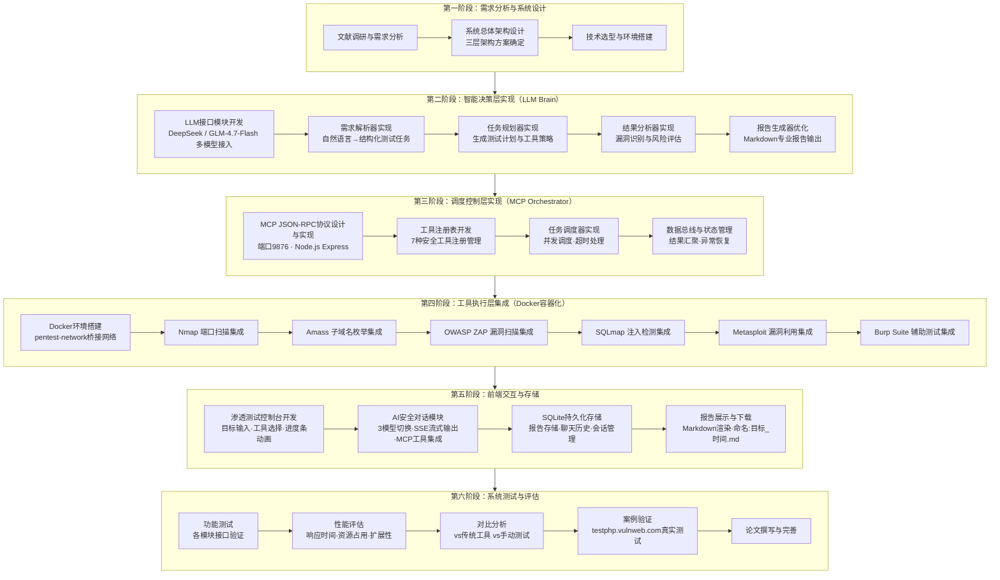

# 基于大模型的Web应用渗透测试智能辅助系统 - 技术路线图

```mermaid
flowchart TD
    subgraph P1["第一阶段：需求分析与系统设计"]
        A1["文献调研与需求分析"]
        A2["系统总体架构设计<br/>三层架构方案确定"]
        A3["技术选型与环境搭建"]
        A1 --> A2 --> A3
    end

    subgraph P2["第二阶段：智能决策层实现（LLM Brain）"]
        B1["LLM接口模块开发<br/>DeepSeek / GLM-4.7-Flash 多模型接入"]
        B2["需求解析器实现<br/>自然语言→结构化测试任务"]
        B3["任务规划器实现<br/>生成测试计划与工具策略"]
        B4["结果分析器实现<br/>漏洞识别与风险评估"]
        B5["报告生成器优化<br/>Markdown专业报告输出"]
        B1 --> B2 --> B3 --> B4 --> B5
    end

    subgraph P3["第三阶段：调度控制层实现（MCP Orchestrator）"]
        C1["MCP JSON-RPC协议设计与实现<br/>端口9876 · Node.js Express"]
        C2["工具注册表开发<br/>7种安全工具注册管理"]
        C3["任务调度器实现<br/>并发调度·超时处理"]
        C4["数据总线与状态管理<br/>结果汇聚·异常恢复"]
        C1 --> C2 --> C3 --> C4
    end

    subgraph P4["第四阶段：工具执行层集成（Docker容器化）"]
        D1["Docker环境搭建<br/>pentest-network桥接网络"]
        D2["Nmap 端口扫描集成"]
        D3["Amass 子域名枚举集成"]
        D4["OWASP ZAP 漏洞扫描集成"]
        D5["SQLmap 注入检测集成"]
        D6["Metasploit 漏洞利用集成"]
        D7["Burp Suite 辅助测试集成"]
        D1 --> D2 --> D3 --> D4 --> D5 --> D6 --> D7
    end

    subgraph P5["第五阶段：前端交互与存储"]
        E1["渗透测试控制台开发<br/>目标输入·工具选择·进度条动画"]
        E2["AI安全对话模块<br/>3模型切换·SSE流式输出·MCP工具集成"]
        E3["SQLite持久化存储<br/>报告存储·聊天历史·会话管理"]
        E4["报告展示与下载<br/>Markdown渲染·命名:目标_时间.md"]
        E1 --> E2 --> E3 --> E4
    end

    subgraph P6["第六阶段：系统测试与评估"]
        F1["功能测试<br/>各模块接口验证"]
        F2["性能评估<br/>响应时间·资源占用·扩展性"]
        F3["对比分析<br/>vs传统工具 vs手动测试"]
        F4["案例验证<br/>testphp.vulnweb.com真实测试"]
        F5["论文撰写与完善"]
        F1 --> F2 --> F3 --> F4 --> F5
    end

    P1 --> P2 --> P3 --> P4 --> P5 --> P6
```
