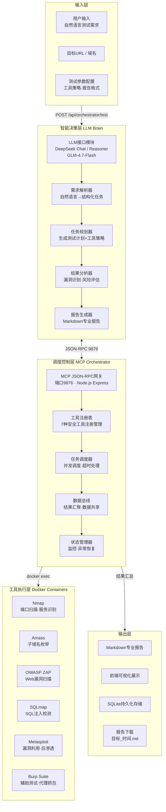
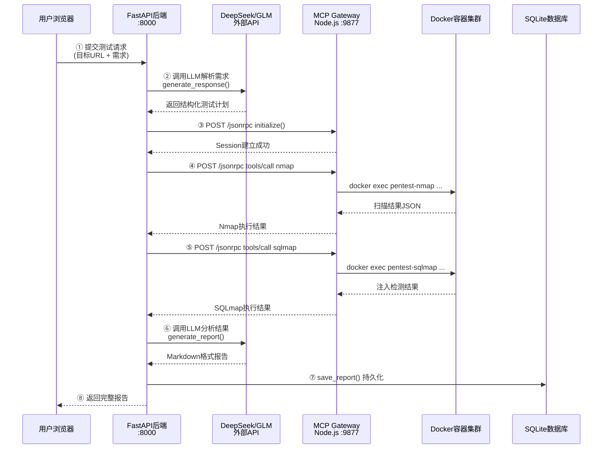
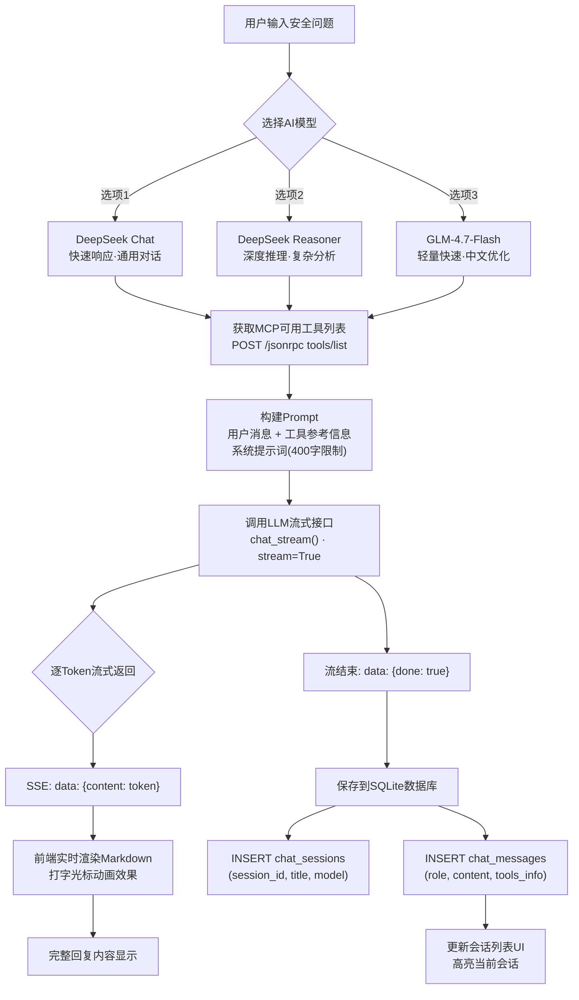
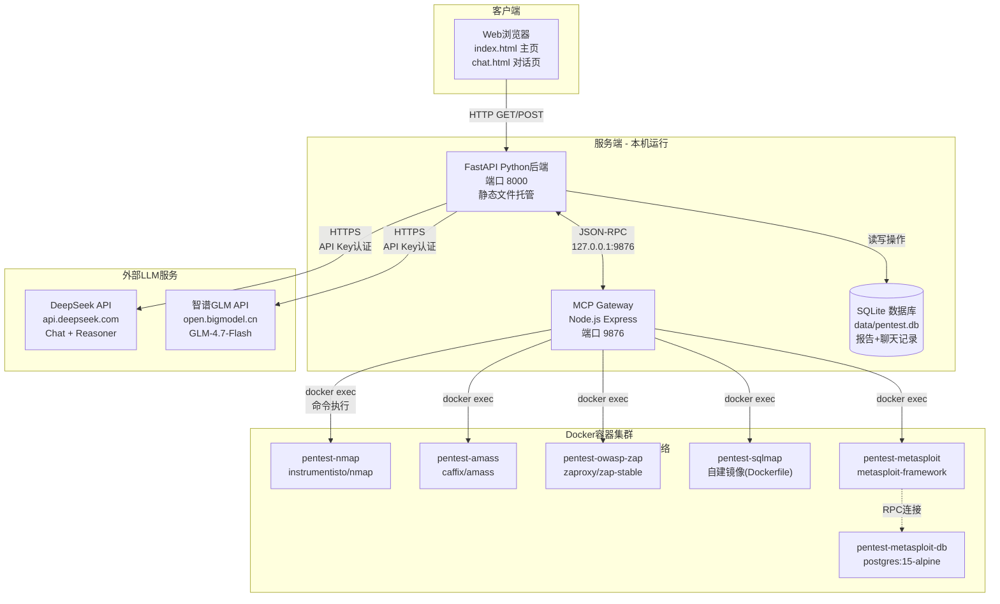

# 技术路线图（论文版 - 竖版）

## 图1：研究总体技术路线

```mermaid
flowchart TD
    subgraph Input["输入层"]
        I1["用户输入<br/>自然语言测试需求"]
        I2["目标URL / 域名"]
        I3["测试参数配置<br/>工具策略·报告格式"]
    end

    subgraph LLM["智能决策层 LLM Brain"]
        direction TB
        L1["LLM接口模块<br/>DeepSeek Chat / Reasoner<br/>GLM-4.7-Flash"]
        L2["需求解析器<br/>自然语言→结构化任务"]
        L3["任务规划器<br/>生成测试计划+工具策略"]
        L4["结果分析器<br/>漏洞识别·风险评估"]
        L5["报告生成器<br/>Markdown专业报告"]
        L1 --> L2 --> L3 --> L4 --> L5
    end

    subgraph MCP["调度控制层 MCP Orchestrator"]
        direction TB
        M1["MCP JSON-RPC网关<br/>端口9876 · Node.js Express"]
        M2["工具注册表<br/>7种安全工具注册管理"]
        M3["任务调度器<br/>并发调度·超时处理"]
        M4["数据总线<br/>结果汇聚·数据共享"]
        M5["状态管理器<br/>监控·异常恢复"]
        M1 --> M2 --> M3 --> M4 --> M5
    end

    subgraph Tools["工具执行层 Docker Containers"]
        T1["Nmap<br/>端口扫描·服务识别"]
        T2["Amass<br/>子域名枚举"]
        T3["OWASP ZAP<br/>Web漏洞扫描"]
        T4["SQLmap<br/>SQL注入检测"]
        T5["Metasploit<br/>漏洞利用·后渗透"]
        T6["Burp Suite<br/>辅助测试·代理抓包"]
    end

    subgraph Output["输出层"]
        O1["Markdown专业报告"]
        O2["前端可视化展示"]
        O3["SQLite持久化存储"]
        O4["报告下载<br/>目标_时间.md"]
    end

    Input -->|"POST /api/orchestrator/test"| LLM
    LLM <-->|"JSON-RPC 9876"| MCP
    MCP -->|"docker exec"| Tools
    MCP -->|"结果汇总"| Output
```

## 图2：数据流转时序图（竖版）

```mermaid
sequenceDiagram
    participant U as 用户浏览器
    participant B as FastAPI后端<br/>:8000
    participant D as DeepSeek/GLM<br/>外部API
    participant M as MCP Gateway<br/>Node.js :9877
    participant C as Docker容器集群
    participant S as SQLite数据库

    U->>B: ① 提交测试请求<br/>(目标URL + 需求)
    B->>D: ② 调用LLM解析需求<br/>generate_response()
    D-->>B: 返回结构化测试计划
    B->>M: ③ POST /jsonrpc initialize()
    M-->>B: Session建立成功
    B->>M: ④ POST /jsonrpc tools/call nmap
    M->>C: docker exec pentest-nmap ...
    C-->>M: 扫描结果JSON
    M-->>B: Nmap执行结果
    B->>M: ⑤ POST /jsonrpc tools/call sqlmap
    M->>C: docker exec pentest-sqlmap ...
    C-->>M: 注入检测结果
    M-->>B: SQLmap执行结果
    B->>D: ⑥ 调用LLM分析结果<br/>generate_report()
    D-->>B: Markdown格式报告
    B->>S: ⑦ save_report() 持久化
    B-->>U: ⑧ 返回完整报告
```

## 图3：AI对话模块技术路线

```mermaid
flowchart TD
    A["用户输入安全问题"] --> B{"选择AI模型"}

    B -->|选项1| C1["DeepSeek Chat<br/>快速响应·通用对话"]
    B -->|选项2| C2["DeepSeek Reasoner<br/>深度推理·复杂分析"]
    B -->|选项3| C3["GLM-4.7-Flash<br/>轻量快速·中文优化"]

    C1 & C2 & C3 --> D["获取MCP可用工具列表<br/>POST /jsonrpc tools/list"]

    D --> E["构建Prompt<br/>用户消息 + 工具参考信息<br/>系统提示词(400字限制)"]

    E --> F["调用LLM流式接口<br/>chat_stream() · stream=True"]

    F --> G{"逐Token流式返回"}
    G --> H["SSE: data: {content: token}"]
    H --> I["前端实时渲染Markdown<br/>打字光标动画效果"]
    I --> J["完整回复内容显示"]

    F --> K["流结束: data: {done: true}"]
    K --> L["保存到SQLite数据库"]
    L --> L1["INSERT chat_sessions<br/>(session_id, title, model)"]
    L --> L2["INSERT chat_messages<br/>(role, content, tools_info)"]
    L2 --> M["更新会话列表UI<br/>高亮当前会话"]
```

## 图4：系统部署架构技术路线

```mermaid
flowchart TD
    subgraph Client["客户端"]
        UI["Web浏览器<br/>index.html 主页<br/>chat.html 对话页"]
    end

    subgraph Server["服务端 - 本机运行"]
        API["FastAPI Python后端<br/>端口 8000<br/>静态文件托管"]
        MCP_SVR["MCP Gateway<br/>Node.js Express<br/>端口 9876"]
        DB[("SQLite 数据库<br/>data/pentest.db<br/>报告+聊天记录")]
    end

    subgraph Docker["Docker容器集群<br/>pentest-network桥接网络"]
        D1["pentest-nmap<br/>instrumentisto/nmap"]
        D2["pentest-amass<br/>caffix/amass"]
        D3["pentest-owasp-zap<br/>zaproxy/zap-stable"]
        D4["pentest-sqlmap<br/>自建镜像(Dockerfile)"]
        D5["pentest-metasploit<br/>metasploit-framework"]
        D6["pentest-metasploit-db<br/>postgres:15-alpine"]
    end

    subgraph External["外部LLM服务"]
        DS["DeepSeek API<br/>api.deepseek.com<br/>Chat + Reasoner"]
        GLM["智谱GLM API<br/>open.bigmodel.cn<br/>GLM-4.7-Flash"]
    end

    UI -->|"HTTP GET/POST"| API
    API <-->|"JSON-RPC<br/>127.0.0.1:9876"| MCP_SVR
    API -->|"读写操作"| DB
    MCP_SVR -->|"docker exec<br/>命令执行"| D1
    MCP_SVR -->|"docker exec"| D2
    MCP_SVR -->|"docker exec"| D3
    MCP_SVR -->|"docker exec"| D4
    MCP_SVR -->|"docker exec"| D5
    D5 -.->|"RPC连接"| D6
    API -->|"HTTPS<br/>API Key认证"| DS
    API -->|"HTTPS<br/>API Key认证"| GLM
```

